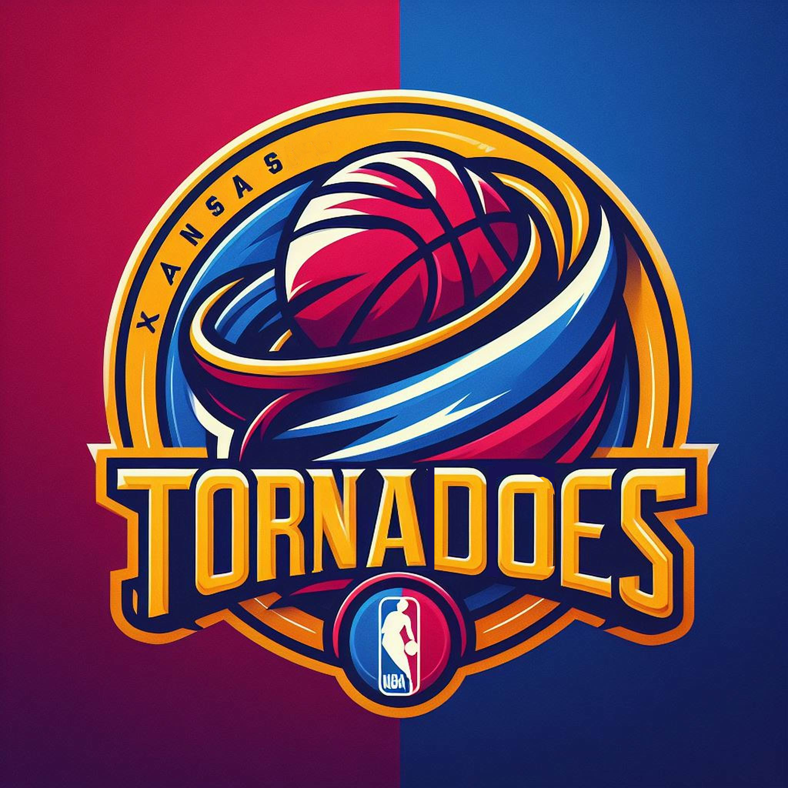

# NBA Expansion Analysis and Visualization

This repository contains the final outputs of a comprehensive analysis aimed at identifying the optimal cities for NBA expansion, along with visualizations and presentations summarizing the findings.

## Project Overview

This project was undertaken by the DEVS team as part of the Smith Analytics Consortium. The analysis uses various datasets and machine learning techniques to recommend the best cities for NBA expansion based on multiple factors including population, infrastructure, cost, and revenue potential.

## Team Members

- Arhab Khan
- Balaji Udayakumar
- Kobe Wang
- Maggie Zheng
- Siddharth Dudla
- Siddharth Khare

## Files and Directories

- `Datathon_FINAL.html`: An HTML file providing an interactive overview of the data analysis process and findings.
- `DEVS_Final_Visualization_Dashboard.twbx`: A Tableau workbook containing visualizations of the analysis results.
- `SAC_Presentation.pdf`: A PowerPoint presentation summarizing the project, methodology, and final recommendations.
- `Datathon_FINAL.ipynb`: A Jupyter notebook containing the code and analysis performed for the project.
- `NBA_cities_data_for_model.xlsx`: Data used for training the machine learning models.(derived from the given dataset)
- `NEW_recommended_cities.xlsx`: A spreadsheet with the final recommended cities for NBA expansion.(derived from the given dataset)

## Key Results

- **Cities Recommended for NBA Expansion**:
  - Kansas City, Missouri
  - Louisville, Kentucky

- **Advantages of Kansas City**:
  - T-Mobile Arena with 18,000 seating capacity
  - Optimal location for growth
  - History of strong sports viewership
  - Higher median education level

- **Advantages of Louisville**:
  - Lower land cost
  - Slightly higher population
  - Lower average wages

## Financial Analysis

- **Kansas City**:
  - **One-Time Costs**:
    - Infrastructure: $1 Billion to $1.3 Billion
    - Drafting Players: $141 Million
    - Total: $1.31 Billion
  - **Recurring Costs**:
    - Operating Expenses: $39.28 Million/year
    - Player Costs: $127 Million/year
    - Taxes: $13.6 Million/year
    - Revenue Sharing: $10.9 Million/year
    - Miscellaneous: $2.16 Million/year
    - Total: $218 Million/year
  - **Revenue**:
    - Arena Sponsorship: $26.82 Million/year
    - Premium Seating: $36.058 Million/year
    - General Seating: $47.68 Million/year
    - Broadcasting Rights: $150.4 Million/year
    - Other: $35.19 Million/year
    - Total: $298 Million/year

## Technical Analysis

The analysis included the use of Random Forest machine learning model to identify key features and clustering to predict the best possible cities for expansion. Additional datasets were gathered to fill missing values and support the final conclusions.

## Marketing and Promotion Strategies

- **Community-driven Streetball Tournaments**: Foster community engagement and identify local talent.
- **Interactive Museum Experience**: Use AR/VR to showcase basketball history in Kansas City.
- **Data-driven Fan Engagement**: Personalize content and promotions using data analytics.

## Visual Assets

## References

- Data sources include the U.S. Census Bureau, Forbes, and various sports viewership statistics.
- Specific URLs and detailed references are included in the `SAC_Presentation.pdf` file.

## Contact

For any questions or further information, please reach out to the DEVS team members.

